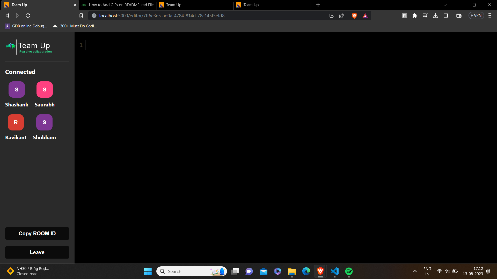

# TEAM UP
## _The realtime Code Editor_


## Introduction:
- Team up is a realtime code editor where users can create the room and other users can join the room using the unique roomID.

- With user-friendly interfaces, users can type/edit the code in the editor and all the users connected in the room will see the changes in realtime.

## Installation

- Git cloning the repository
```
git clone https://github.com/shashank8987/TeamUp.git
```
- Installing all required modules
```
npm install
```
- Run the following command to start with the project
```
npm start
```


## Technology Stack:

- ReactJs
- Socket.io
- NodeJs
- Express
- CodeMirror for themes

## Screenshots:

- **Home Page provide users with a form where user can enter the roomID and username to join the pre-existing room**


<br/>
<br/>
- **Users can also create the new room and invite other teammates to join the room by sharing the roomID**


<br/>
<br/>
- **After joining the room the new joinee can see all connected members on the left side of the screen**


<br/>
<br/>
- **All the existing users in the room can edit the code and the changes will be visible to all the users in realtime**


<br/>
<br/>
- **If any member leaves the room his name will be removed from the connected members list**


### Developed by - Shashank Shekhar